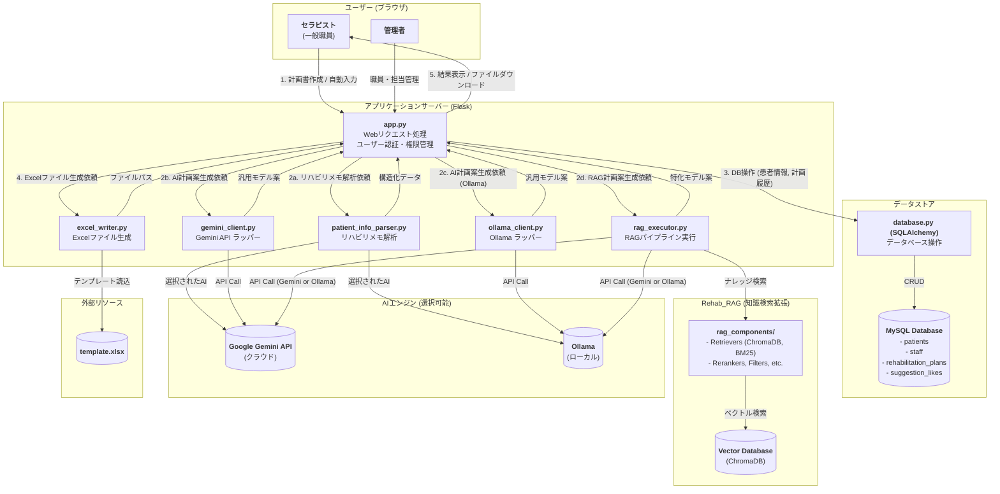

# TODOリスト https://docs.google.com/spreadsheets/d/1LUPwF4_KGJmqr2arcKsvYtvXsHZAtH2LK5qUAqHK1d0/edit?gid=1386834576#gid=1386834576
終わったタスクはチェックボックスをtrueにし、実施者がだれか明記&コミット名を書いていただけると幸いです。 <br><br>


# リハビリテーション総合実施計画書 自動作成システム

## 1. 概要 (Overview)

データベースに登録された患者情報と、担当療法士が入力した所見を基に、AIを使用して計画書の主要項目（方針、リスク、内容など）を自動生成します。

AIエンジンとして、Googleの**Gemini API**（クラウド）と、**Ollama**（ローカルLLM）の両方をサポートしており、環境変数で切り替えて使用することが可能です。

さらに、**RAG (Retrieval-Augmented Generation)** 技術を導入し、専門的なガイドライン文書を知識源として参照することで、より高精度で根拠に基づいた計画案の生成も可能です。

完成した計画書は、使い慣れたExcel形式でダウンロードできます。

-----

## 2. 主な機能 (Features)

このシステムは、リハビリテーション計画書作成のワークフローを効率化し、質を高めるための多彩な機能を搭載しています。

### 🧑‍⚕️ 患者情報入力支援 (Patient Information Input Support)

  * **AIによる患者情報の自動入力機能**
    日々のリハビリ実施時のメモや申し送り事項などの自由記述テキストをコピー＆ペーストするだけで、AI（GeminiまたはOllama）が内容を解析。患者の動作などの情報を自動で抽出し、フォームの各項目に振り分けます。これにより、煩雑な手入力を大幅に削減します。

  * **患者情報マスタ管理**
    新規患者の登録や、既存の患者情報の編集を行うための専用画面を用意しています。AIによる自動入力結果の修正や、評価項目の更新などをいつでも行うことができます。

### 🤖 AIによる計画書作成支援 (AI-Assisted Plan Creation)

  * **デュアルAIモデルによる提案**
    目的の異なる2種類のAIモデルが、計画書の各項目に対して同時に提案を生成します。

    1.  **通常モデル**: 患者の全体的な情報（年齢、診断名、ADLなど）から、臨床的に妥当な計画案を幅広く生成します（GeminiまたはOllamaを使用）。
    2.  **特化モデル (RAG)**: 臨床ガイドラインなどの専門文書を知識源として参照し、よりエビデンスに基づいた、専門性の高い計画案を生成します。

  * **提案比較とフィードバック機能**
    生成された2つのAI提案を画面上で簡単に切り替えて比較できます。より良いと感じた提案を「いいね」ボタンで評価することができ、このフィードバックは将来のAIモデル改善に活用されます。

  * **非同期ストリーミング表示**
    AIが計画書を生成する際、完成した項目から順次リアルタイムで画面に表示します。全ての生成が終わるのを待つ必要がなく、すぐに内容の確認や編集作業を開始できるため、時間的なストレスを軽減します。

### 📂 データ管理と出力 (Data Management & Output)

  * **計画書履歴の保存と閲覧**
    作成・保存された全ての計画書はデータベースに履歴として記録されます。患者情報マスタ画面から過去の計画書にいつでもアクセスし、内容を閲覧することができます。

  * **Excelファイル出力**
    最終的に確定した計画書は、院内の公式書式に基づいたExcelファイルとしてダウンロードできます。これにより、印刷や電子カルテへの添付が容易になります。

### 🔒 セキュアなユーザー管理 (Secure User Management)

  * **職員アカウントと権限管理**
    Flask-Loginを用いた堅牢なログイン機能を実装。パスワードは安全にハッシュ化して保存されます。管理者(admin)と一般職員(general)の役割（ロール）があり、利用できる機能を制限しています。

  * **担当制によるアクセス制御**
    管理者は、どの職員がどの患者を担当するかをWeb画面から簡単に割り当て・解除できます。一般職員は、自分に割り当てられた患者の情報のみ閲覧・操作が可能で、担当外の患者情報にはアクセスできません。

-----

## 3. システム構成図 (Architecture)



-----

## 4. 使用技術 (Technology Stack)

  * **バックエンド**: Python, Flask, Flask-Login, SQLAlchemy
  * **フロントエンド**: HTML, CSS, JavaScript
  * **データベース**: MySQL, ChromaDB (ベクトルデータベース)
  * **AIエンジン**: Google Gemini API, Ollama (ローカルLLM)
  * **RAGパイプライン**:
      * **Embedding**: Sentence-Transformers, Gemini Embedding API
      * **キーワード検索**: BM25 (rank-bm25)
      * **リランキング**: Cross-Encoder (sentence-transformers)
      * **フィルタリング**: NLI (transformers)
      * **評価**: Ragas
      * **ナレッジグラフ**: Neo4j
  * **Pythonライブラリ**: `PyMySQL`, `openpyxl`, `pydantic`, `python-dotenv`, `gunicorn`, `mecab-python3`, `bcrypt`, `requests`, `ollama`
  * **コンテナ**: Docker, Docker Compose

-----

## 5. セットアップと実行方法 (Getting Started)

ローカル環境で直接実行する方法と、Docker Composeを使用してコンテナで実行する方法があります。
**Docker Composeの使用を推奨します。**

### 5.1. 前提条件

  * **共通**:
      * Git
  * **Docker Composeで実行する場合 (推奨)**:
      * Docker Desktop (Windows/Mac) または Docker Engine/Docker Compose (Linux)
  * **ローカルで直接実行する場合**:
      * Python 3.11 以降
      * MySQL Server 8.0
      * (ハイブリッド検索利用時) MeCab
  * **AIモデルの準備 (いずれか必須)**:
      * **Gemini (クラウド)**: Google Gemini APIキー (Google AI Studio で取得)
      * **Ollama (ローカル)**: Ollamaがインストールされ、モデル（例: `qwen3:8b`）がダウンロード済みであること。

#### **Python仮想環境の作成と有効化(Dockerを使わない場合)**

```bash
# Windows
python -m venv venv_rehab
.\venv_rehab\Scripts\activate

# macOS / Linux
python3 -m venv venv_rehab
source venv_rehab/bin/activate
```

```bash
pip install -r requirements.txt
```

#### **データベースの構築と管理者アカウントの作成(Dockerを使わない場合)**
**5-A. (Windows利用者向け) ターミナルの文字コード設定**
まず、ターミナル（コマンドプロンプトやPowerShell）で以下のコマンドを実行し、文字コードを`UTF-8`に設定します。**これは日本語の文字化けを防ぐために必須です。**

```bash
chcp 65001
```

**5-B. 最初の管理者用パスワードを生成する**
次に、管理者アカウントのパスワードを安全な「ハッシュ値」に変換します。ターミナルで以下のコマンドを実行してください。`****`の部分は、あなたが決めたい安全なパスワードに置き換えます。

```bash
Create-Hash.ps1
```

**実行例:**

```bash
Create-Hash.ps1
仮想環境を有効化しました。

PowerShell credential request
ハッシュ化したいパスワードを入力してください
Password for user password: ****

--- Pythonスクリプトを実行します ---
生成されたハッシュ値: scrypt:1234567890qwertyuiopasdfghjklzxcvbnm
------------------------------------
```

実行すると、`scrypt:...`で始まる長い文字列（ハッシュ値）が表示されます。**このハッシュ値をコピーしてください。**

**5-C. `schema.sql`にハッシュ値を貼り付ける**
`schema.sql`ファイルを開き、末尾にある`staff`テーブルへの`INSERT`文を探します。そして、**コピーしたハッシュ値を指定の場所に貼り付け**てください。

```sql
-- 変更前
INSERT INTO staff (`id`, `username`, `password`, `role`)
VALUES (1, 'admin', 'ここに先ほどコピーしたハッシュ値を貼り付け', 'admin')
-- ...
```

**`'ここに先ほどコピーしたハッシュ値を貼り付け'`** の部分を、先ほど生成したハッシュ値に置き換えます。

**5-D. データベースを構築する**
ターミナルから以下のコマンドを実行し、`schema.sql`の内容をデータベースに反映させます。`<your_user>`はMySQLのユーザー名です(`root`でいいと思います。)。

```bash
mysql -u <your_user> -p
# あなたのパスワードを入力後
source schema.sql
```

コマンド実行後、パスワードを求められるので入力します。その後、sqlファイルを読み込み、エラーが出なければ、データベースの準備は完了です。

### 5.2. `.env`ファイルの作成 (必須)

まず、リポジトリをクローンし、そのルートディレクトリに `.env` ファイルを作成します。

```bash
git clone https://github.com/YouSayH/kcr_Rehab-Plan-Generator.git
cd kcr_Rehab-Plan-Generator
touch .env
```

作成した `.env` ファイルに、実行環境に合わせて以下の内容を記述します。

```dotenv
# --- 必須: Flaskアプリケーション設定 ---
# Flaskのセッション管理やflashメッセージに使用する秘密鍵 (自分で適当な文字列に変更してください)
SECRET_KEY="your_very_secret_flask_key_here_please_change_me"

# --- 必須: データベース接続設定 ---
# (Docker Composeで起動する場合、DB_HOSTは "db" に設定してください)
# (ローカルで起動する場合、DB_HOSTは "localhost" や "127.0.0.1" に設定してください)
DB_HOST="db" # "db"または"localhost"
DB_USER="your_db_user" # おそらく root でok
DB_PASSWORD="your_db_password"
DB_NAME="rehab_db"

# --- 必須: MySQL (docker-compose.ymlと合わせる) ---
# (docker-compose.ymlの 'db' サービスで使用します)
MYSQL_ROOT_PASSWORD="your_root_password"
MYSQL_USER="your_db_user"
MYSQL_PASSWORD="your_db_password"
MYSQL_DATABASE="rehab_db"

# --- AIモデル選択 (どちらを使用するか) ---
# "gemini" (クラウドAPI) または "ollama" (ローカル) を選択
LLM_CLIENT_TYPE="gemini"

# --- Gemini (クラウド) を使用する場合 ---
# (LLM_CLIENT_TYPE="gemini" の場合必須)
GOOGLE_API_KEY="your_google_api_key_here"

# --- Ollama (ローカル) を使用する場合 ---
# (LLM_CLIENT_TYPE="ollama" の場合必須)
# `ollama pull qwen3:8b` などで事前にダウンロードしたモデル名を指定
OLLAMA_MODEL_NAME="qwen3:8b"
# (DockerからローカルホストのOllamaに接続する場合、"host.docker.internal" を指定)
# OLLAMA_HOST="http://host.docker.internal:11434"
```

### 5.3. 実行方法1: Docker Compose (推奨)

この方法が最も簡単で、MySQLやPython、MeCabの環境構築をDockerが全て行います。

#### ステップ1: 最初の管理者パスワードのハッシュを生成

`schema.sql` にはデフォルトの管理者パスワード（のハッシュ値）が含まれていますが、セキュリティのために変更することを推奨します。

ローカルのPowerShellで `Create-Hash.ps1` を実行（またはPythonで `create_hash.py` を実行）して新しいハッシュ値を生成し、`schema.sql` 末尾の`INSERT INTO staff`文にある`password`の値を置き換えてください。

#### ステップ2: RAGデータベースの構築

特化モデル(RAG)を使用するには、先に知識源のデータベースを構築する必要があります。
`rag_config.yaml` で使用するパイプライン（例: `hybrid_search_experiment`）が設定されていることを確認してください。

```bash
# Docker Compose で RAG DB 構築コマンドを実行
docker-compose run --user root web python Rehab_RAG/experiments/hybrid_search_experiment/build_database.py
```

*(このコマンドは `rag_db_data` ボリュームが作成されるため、一度実行すればOKです)*

#### ステップ3: Docker Composeの起動

ターミナルで以下のコマンドを実行します。

```bash
# イメージをビルドし、コンテナをバックグラウンドで起動
docker-compose up --build -d
```

  * `--build`: `Dockerfile` に変更があった場合にイメージを再構築します。
  * `-d`: コンテナをバックグラウンドで実行します。

初回起動時、`db`サービス（MySQL）は自動的に`schema.sql` を読み込み、必要なテーブルと管理者アカウントを作成します。

#### ステップ4: アプリケーションへのアクセス

Webブラウザで **`http://localhost:5000`** にアクセスします。
ログイン画面が表示されたら、`schema.sql` で設定した管理者アカウント（デフォルト: `admin` / `adminpass`）でログインしてください。

#### Dockerの停止

```bash
# コンテナを停止・削除
docker-compose down
# データベースボリューム(mysql_data, rag_db_data)も削除して完全にクリーンアップする場合
docker-compose down -v
```

### 5.4. 実行方法2: ローカル環境 (非推奨)

#### ステップ1: 依存ライブラリのインストール

```bash
# 仮想環境を作成
python -m venv venv_rehab
# 有効化 (Windows)
.\venv_rehab\Scripts\activate
# 依存ライブラリをインストール
pip install -r requirements.txt
```

*(ハイブリッド検索を使用する場合は、`Rehab_RAG/README.md` を参照してMeCabをインストールしてください)*

#### ステップ2: データベースのセットアップ

1.  ローカルのMySQLサーバーを起動します。
2.  `.env`ファイルに設定した `DB_USER` と `DB_PASSWORD` でMySQLにログインし、データベースを作成します。
    ```sql
    CREATE DATABASE rehab_db CHARACTER SET utf8mb4 COLLATE utf8mb4_general_ci;
    ```
3.  `schema.sql` を実行してテーブルと管理者アカウントを作成します（「5.2. `.env`ファイルの作成」のステップ1を参照）。
    ```bash
    mysql -u your_db_user -p rehab_db < schema.sql
    ```

#### ステップ3: RAGデータベースの構築

```bash
# Rehab_RAG/experiments/ 内の、使用したいパイプラインの build_database.py を実行
python Rehab_RAG/experiments/hybrid_search_experiment/build_database.py
```

#### ステップ4: アプリケーションの起動

```bash
python app.py
```

Webブラウザで **`http://localhost:5000`** にアクセスしてください。

### 5.5. Ollama (ローカルLLM) の使用方法

Gemini APIの代わりに、ローカルマシンで動作するOllamaを使用できます。

1.  **Ollamaのインストール**: [Ollama公式サイト](https://ollama.com/) からOllamaをダウンロードし、インストールします。
2.  **モデルのダウンロード**: ターミナルで、使用したいモデルをダウンロードします。
    ```bash
    # (推奨モデル: qwen3:8b)
    ollama pull qwen3:8b
    ```
3.  **`.env`ファイルの編集**: `.env`ファイルを以下のように編集します。
    ```dotenv
    # AIモデルをOllamaに切り替え
    LLM_CLIENT_TYPE="ollama"

    # 使用するモデル名を指定
    OLLAMA_MODEL_NAME="qwen3:8b"

    # (DockerからホストOSのOllamaに接続する場合)
    # Windows/Mac の Docker Desktop:
    OLLAMA_HOST="http://host.docker.internal:11434"
    # Linux の場合 (ホストのIPアドレスを確認して指定):
    # OLLAMA_HOST="http://172.17.0.1:11434" 
    ```
4.  **アプリケーションの起動**: 上記の手順（Docker Compose または ローカル）でアプリケーションを起動します。`app.py` が環境変数を読み取り、`ollama_client.py` を使用するようになります。

-----

## 6. ファイル構成 (File Structure)

```
/kcr_Rehab-Plan-Generator
│
│  app.py                 # Flaskアプリケーション本体
│  database.py            # DB操作モジュール (SQLAlchemy)
│  gemini_client.py       # Gemini API通信モジュール
│  ollama_client.py       # Ollama通信モジュール
│  patient_info_parser.py # カルテテキスト解析モジュール
│  excel_writer.py        # Excel生成モジュール
│  schema.sql             # DBスキーマ定義
│  requirements.txt       # 依存ライブラリ
│  Dockerfile             # Dockerイメージ定義
│  docker-compose.yml     # Docker Compose定義
│  template.xlsx          # Excelテンプレート
│  .env                   # 【要手動作成】環境変数ファイル
│
├─/Rehab_RAG/             # RAG(検索拡張生成)の実験・評価用サブモジュール
│  │  README.md           # RAGモジュールの詳細説明
│  └─/source_documents/  # RAGが参照する知識源ドキュメントを格納
│
├─/static/
│      style.css          # CSSスタイルシート
│
└─/templates/
       index.html         # トップページ
       edit_patient_info.html # 患者情報マスタ編集ページ
       confirm.html       # 計画書 確認・修正ページ
       login.html         # ログインページ
       ...                # その他HTMLファイル
```

-----

## 7. RAG（検索拡張生成）について

このアプリケーションの「特化モデル」は、`Rehab_RAG`という独立したサブモジュールによって実現されています。

`Rehab_RAG`は、臨床ガイドラインなどの専門文書を知識源としてAIが回答を生成するための、**体系的な実験・評価フレームワーク**です。

### 🧩 Rehab\_RAGの主な役割

  * **知識源のデータベース化**: `source_documents`フォルダ内のMarkdown形式の専門文書を、AIが検索しやすいベクトルデータベースに変換します。
  * **高度な検索パイプラインの実行**: 以下のコンポーネントを柔軟に組み合わせ、患者情報に最も関連性の高い情報を知識源から検索します。
      * **Query Enhancers**: ユーザーの質問をAIが検索しやすいように拡張します（HyDE, Multi-Query など）。
      * **Retrievers**: キーワード検索（BM25）と意味検索（ベクトル検索）を組み合わせたハイブリッド検索 や、知識グラフ検索 を実行します。
      * **Rerankers / Filters**: 検索結果の精度を高めるために、情報の並べ替え やノイズ除去 を行います。
  * **性能評価**: Ragasフレームワーク を利用し、各手法の組み合わせの性能を客観的な指標で評価します。

より詳細な技術解説や各コンポーネントの役割については、`Rehab_RAG`モジュールのREADMEをご覧ください。

> ➡️ **[Rehab\_RAG/README.mdを読む](https://github.com/YouSayH/kcr_Rehab-Plan-Generator/tree/main/Rehab_RAG)**

-----

## 8. トラブルシューティング (Troubleshooting) 🛠️

  * **エラー: `(1049, "Unknown database 'rehab_db'")`**

      * **原因**: データベースが作成されていません。
      * **解決策**: (ローカル実行の場合) 「5.4. 実行方法2」のステップ2を正しく実行してください。(Dockerの場合) `docker-compose.yml` と `.env` の `MYSQL_DATABASE` や `DB_NAME` の設定が一致しているか確認してください。

  * **エラー: `ERROR 1406 (Data too long)` や `Incorrect string value` (MySQL)**

      * **原因**: データベースまたはターミナルの文字コードが日本語に対応していません。
      * **解決策**: `schema.sql` の先頭にある `CREATE DATABASE...` 文で `utf8mb4` が指定されていることを確認してください。Docker Composeで実行する場合、`command`で文字コードが指定されているため、この問題は起きにくいです。

  * **ログインできない場合**

      * **原因**: `schema.sql` に設定したパスワードのハッシュ値が間違っているか、`admin` ユーザーが作成されていません。
      * **解決策**: 「5.3. 実行方法1」のステップ1を再度慎重に行い、正しいハッシュ値が`schema.sql`に登録されているか確認してください。

  * **Dockerコンテナが`db`サービスで待機したまま起動しない**

      * **原因**: `db`（MySQL）コンテナがヘルスチェックに失敗しています。多くの場合、`.env`ファイルの`DB_USER`や`DB_PASSWORD`が、`MYSQL_USER`や`MYSQL_PASSWORD`と一致していません。
      * **解決策**: `.env`ファイル内の `DB_USER` と `MYSQL_USER`、`DB_PASSWORD` と `MYSQL_PASSWORD` の値が **完全に一致** していることを確認してください。

  * **Ollama使用時に "Connection refused" エラーが出る**

      * **原因**: `web`コンテナ（Docker）からホストOS（ローカルマシン）で実行中のOllamaに接続できていません。
      * **解決策**: `.env`ファイルで`OLLAMA_HOST`変数を設定してください。
          * Docker Desktop for Windows/Mac の場合: `OLLAMA_HOST="http://host.docker.internal:11434"`
          * Linuxの場合: `docker network inspect bridge` などでホストのIPアドレス（例: `172.17.0.1`）を調べ、`OLLAMA_HOST="http://172.17.0.1:11434"` のように設定します。

-----

## 9. 注意事項 (Notes)

  * このシステムはプロトタイプです。`.env` ファイルに設定する `SECRET_KEY` は、本番環境で運用する際には必ず複雑で安全なものに変更してください。
  * 本番環境では、GunicornやuWSGIなどのWSGIサーバーを使用することを強く推奨します（`Dockerfile` ではGunicornを使用しています）。
  * `gemini_client.py` と `ollama_client.py` の `USE_DUMMY_DATA` フラグを `True` にすると、APIを呼び出さずにテスト用のダミーデータを使用できます。